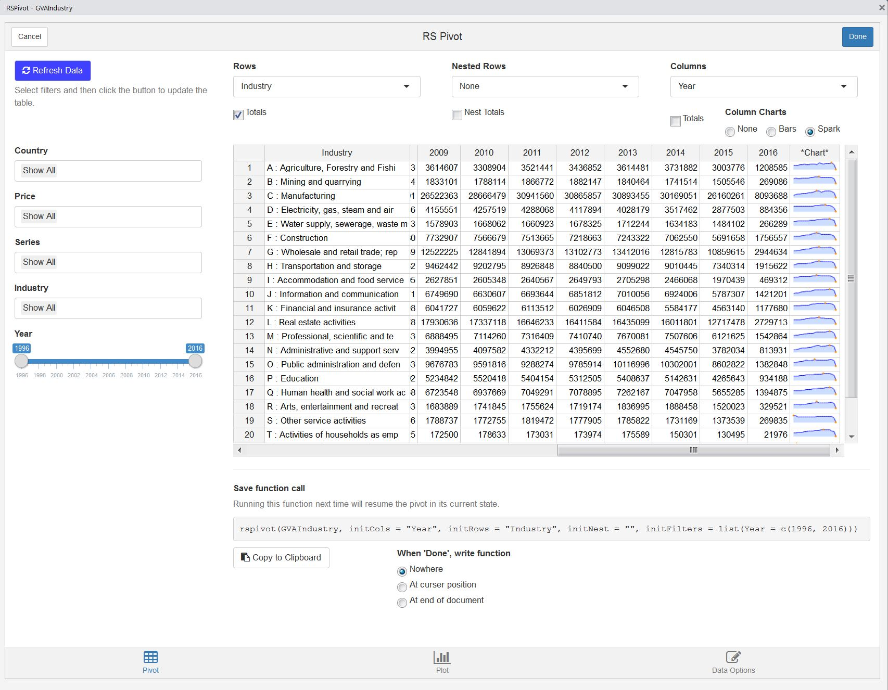

```{r setup, include = FALSE}
knitr::opts_chunk$set(
  collapse = TRUE,
  comment = "#>"
)
```

rspivot is a Shiny gadget for RStudio for viewing data frames.

The `View()` function in RStudio displays data frames and tibbles as they are stored in the R environment: flat files of many rows and columns. Though `View()` provides the ability to filter series using a single parameter or value range, it lacks many tools necessary for properly examing output. `rspivot` provides an alternative to `View()` by viewing data frames and tibbles as interactive pivot tables.

## The rspivot Window

Running `rspivot()` will cause [Shiny gadget](https://shiny.rstudio.com/articles/gadgets.html) window to open in RStudio. By default, the gadget will use the last created object in the enviroment using the `.Last.value` object in R. This object must be a data frame or a tibble.

Alternatively, you can pass any data frame to the function. The easiest option is to use a data frame with a single column of values, labeled `value`. Passing `GVAIndustry`, a data frame of macroeconomic series from Eurostat included in the package, results in the window below.
``` r
rspivot(GVAIndustry)
```
```{r, out.width = "650px", echo=FALSE}

```

### Table

By default, the table of values displays the sum of all data values in the table, split by the series shown in the rows and columns. The rows and columns are sorted to match the same order of the elements in the data frame. To sort in ascending or descending order, click the column names in the table.

### Rows, Nested Rows, and Columns

The top three menus list each of the series in the data frame to use as the rows and columns in the pivot table. Additionally, you can choose to nest row values to show the combination of two series.

For each series displayed in the table, the checkbox below the select menus toggles the marginal totals. The row and nested row totals are added as the last element in the series. The column total is appended as a column on the righthand side of the table.

An additional option for columns is to show sparkline or bar charts, displaying the values of every column in each row.

### Filters

For each series in the data frame, excluding the values, there will be a filter on the lefthand side of the rspivot window. For most series, these will be a dropdown box, allowing the user to choose one or many options.

These select menus filter the data frame to only include the rows of data that contain those elements. 

Each menu defaults to only one item, "Show All". This item provides a shortcut to include all elements in a series, without overcrowding the menu windows. Including this option in a filter selection, even with other specific elements, will always include all elements and therefore will not filter the data frame over that series.

If a series is strictly numeric (e.g. Year), then the filter menu will be a slider input, specifying the minimum and maximum values to filter.

The data frame will not be filtered until pressing the blue "Refresh Data" button on the top right. This will ensure the gadget runs smoothly for large data frames.

### Resuming table state

The default state of an `rspivot` window to include all elements in each series, using the right-most series in the data frame as the columns and the second right-most series as the rows. These defaults can be changed in the function call.

The easiest way to change the defaults is to initially run the `rspivot()` function without changing any inputs. Use the menus to select the desired filters, rows, and columns. Below the table, `rspivot` prints out the function call that can be used in the future to resume the state of the table, even if the data changes.

```{r, out.width = "650px", echo=FALSE}
knitr::include_graphics("rspivot_img/1_savestate.JPG")
```

This area includes the option to copy the function call onto the clipboard, which can be pasted in the console or R script. Alternatively, you can select the option to automatically print the final function call into your console or script (wherever the curser is active) after clicking the "Done" button.


```r
rspivot(GVAIndustry, initCols = "Year", initRows = "Country", initNest = "", 
           initFilters = list(Country = c("Greece", "Spain", "Portugal", "Italy"),
                              Price = c("Nominal"), 
                              Series = c("Gross Value Added"), Year = c(2004, 2014)))
```

## Graphical view

## Data options

### Pivot table values

#### Sum

#### Mean, Median, Min, Max

#### Custom functions

### Data Modes

### Other value options